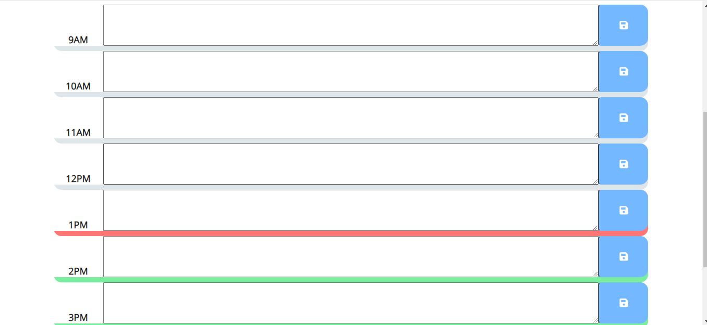

# Work Planner App

This application will allow you to register appointments and activities you have in your work day. 
It will allow you to log any activity you have in the day in the according hour.

First you must write the activity at the correct hour and select the button to the right to save it.
You´ll get a prompt telling you that the data was saved successfully to your local storage.

You might notice that depending on the hour of the day, the calendar will show three different colors on the time blocks, signifying if that hour has passed, if it´s the current hour, or if it will happen in the future.

